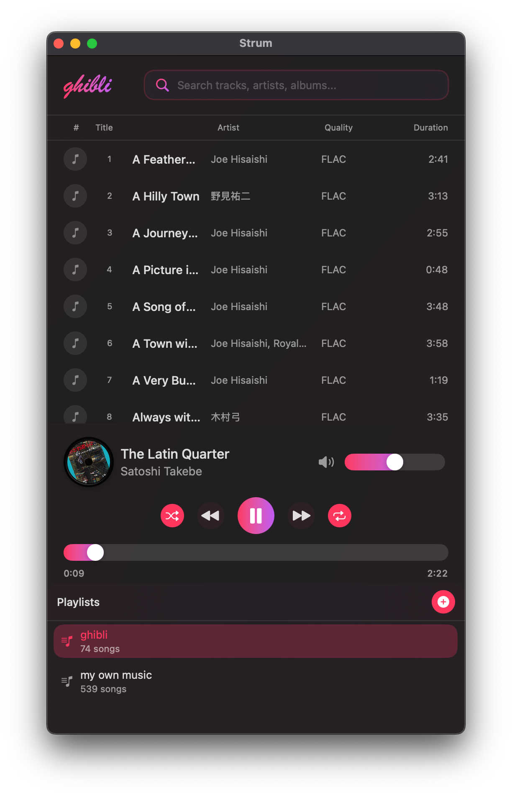

# 🎵 Strum

**A beautiful, modern music player for macOS**

*Version 1.0* • *by Quan Ngo*

---

## 📸 Screenshots

<div align="center">

| Full View | Compact Mode |
|-----------|--------------|
|  |  |

| Theme Settings | About Dialog |
|----------------|--------------|
|  |  |

</div>

---

## 🎬 Demo

[](https://youtu.be/FNN-WXCf2u8)

*Click the image above to watch the demo video*

## ✨ Features
Strum is an elegant music player designed specifically for macOS, offering a seamless audio experience with beautiful theming, intuitive playlist management, and comprehensive format support. Built with SwiftUI and optimized for performance, Strum brings your music collection to life with style.

### 🎨 **Beautiful Design**
- **6 Stunning Color Themes**: Ocean Blue, Tropical Teal, Royal Purple, Rose Pink, Tangerine, and Classic Red
- **Dynamic App Icons**: App icon changes automatically to match your selected theme
- **Responsive Layout**: Seamlessly adapts between desktop and compact modes
- **Modern UI**: Clean, intuitive interface with smooth animations and blur effects

### 🎵 **Comprehensive Audio Support**
- **Multiple Formats**: MP3, FLAC, M4A, WAV, AAC, OGG, WMA
- **High-Quality Playback**: Optimized audio engine with volume control and seeking
- **Metadata Extraction**: Automatic extraction of title, artist, album, and artwork
- **FLAC Optimization**: Enhanced metadata and artwork extraction for FLAC files

### 📚 **Smart Playlist Management**
- **Multiple Playlists**: Create and organize unlimited playlists
- **Drag & Drop Import**: Easy file and folder importing
- **Bulk Operations**: Import entire music folders with progress tracking
- **Search & Filter**: Quickly find tracks across all playlists
- **Persistent Storage**: Automatic saving with security-scoped bookmarks

### 🎛️ **Advanced Playback Controls**
- **Shuffle & Repeat**: Multiple playback modes for varied listening
- **Media Key Support**: Integration with macOS media controls
- **Now Playing**: Rich metadata display in macOS Control Center
- **Keyboard Shortcuts**: Full keyboard navigation support

### ⚡ **Performance Optimized**
- **Smooth UI**: All operations designed for fluid user experience
- **Background Processing**: Large imports with progress indicators
- **Memory Efficient**: Optimized for handling large music libraries
- **Sandboxed Security**: Full macOS App Sandbox compliance

## 🚀 Quick Start

1. **Download** Strum from the releases page
2. **Install** by dragging to your Applications folder
3. **Import** your music using File → Import Files/Folder or drag & drop
4. **Customize** your experience in Preferences (⌘,)
5. **Enjoy** your music with beautiful themes and smooth playback!

## 🎹 Keyboard Shortcuts

| Action | Shortcut |
|--------|----------|
| Play/Pause | `Space` |
| Previous Track | `⌘ + ←` |
| Next Track | `⌘ + →` |
| Close Popups | `Esc` |

## 🎨 Themes

Strum features six carefully crafted color themes:

- **🌊 Ocean Blue** - Calming blue tones
- **🏝️ Tropical Teal** - Refreshing teal gradients
- **👑 Royal Purple** - Elegant purple hues
- **🌸 Rose Pink** - Soft pink aesthetics
- **🍊 Tangerine** - Vibrant orange warmth
- **❤️ Classic Red** - Bold red accents

Each theme includes dynamic app icon matching for a cohesive experience.

## 📱 System Requirements

- **macOS 12.0** or later
- **Apple Silicon** or Intel processor
- **50 MB** available storage

## 🔒 Privacy & Security

Strum is built with privacy in mind:
- **No Data Collection**: Your music stays on your device
- **Sandboxed**: Full macOS App Sandbox compliance
- **Secure Access**: Security-scoped bookmarks for file access
- **Local Processing**: All metadata extraction happens locally

---

<details>
<summary><h2>📚 Technical Documentation</h2></summary>

## 🏗️ Architecture Overview

Strum is built using modern SwiftUI architecture with a clear separation of concerns:

### Core Components

#### **Models**
- **Track**: Represents individual audio files with comprehensive metadata
- **Playlist**: Manages collections of tracks with CRUD operations
- **PlayerState**: Enumerations for player states and playback modes

#### **Managers**
- **PlaylistManager**: Handles playlist operations, file imports, and persistence
- **MusicPlayerManager**: Controls audio playback, shuffle/repeat modes, and media integration
- **PreferencesManager**: Manages app settings, themes, and user preferences

#### **UI System**
- **DesignSystem**: Centralized styling with colors, typography, and spacing
- **ColorTheme**: Dynamic theming system with 6 predefined themes
- **Responsive Layout**: Adaptive UI that scales from compact to desktop modes

## 🛠️ Technical Features

### **Audio Processing**
- **AVAudioPlayer**: Core audio playback engine
- **FLACMetadataKit**: Custom FLAC metadata extraction
- **Security-Scoped Bookmarks**: Persistent file access in sandboxed environment
- **Background Processing**: Non-blocking file imports with progress tracking

### **Data Persistence**
- **UserDefaults**: Lightweight preference storage
- **JSON Encoding**: Playlist data serialization
- **Automatic Saving**: Real-time data persistence with app lifecycle management

### **Performance Optimizations**
- **Lazy Loading**: Efficient memory usage for large libraries
- **Background Queues**: Non-blocking UI operations
- **Caching**: Artwork and metadata caching for improved performance
- **Responsive Design**: Adaptive layouts for optimal user experience

## 📁 Project Structure

```
Strum/
├── App/                          # Application entry point
│   └── StrumApp.swift           # Main app configuration
├── Core/                        # Business logic and data
│   ├── Models/                  # Data models
│   │   ├── Track.swift         # Audio track with metadata
│   │   ├── Playlist.swift      # Playlist management
│   │   └── PlayerState.swift   # Player state enums
│   └── Managers/               # Business logic managers
│       ├── PlaylistManager.swift      # Playlist operations
│       ├── MusicPlayerManager.swift   # Audio playback
│       └── PreferencesManager.swift   # Settings management
├── UI/                          # User interface components
│   ├── Views/                   # Main view components
│   │   ├── ContentView.swift   # Root view controller
│   │   ├── TrackListView.swift # Track listing and management
│   │   └── PlayerControlsView.swift # Playback controls
│   ├── Components/             # Reusable UI components
│   │   ├── PlaylistSidebar.swift     # Playlist navigation
│   │   ├── TrackRowView.swift        # Individual track display
│   │   └── SearchBar.swift           # Search functionality
│   ├── Popups/                 # Modal dialogs and overlays
│   │   ├── PreferencesView.swift     # Settings interface
│   │   ├── AboutView.swift           # About dialog
│   │   └── ToastView.swift           # Notification system
│   └── DesignSystem/           # Styling and theming
│       ├── DesignSystem.swift        # Core design tokens
│       ├── ColorTheme.swift          # Theme definitions
│       └── ButtonStyles.swift        # Custom button styles
└── Resources/                   # Static assets and configuration
    ├── Assets.xcassets         # Images and icons
    └── Supporting Files/       # Configuration files
```

## 🔧 Development Setup

### **Prerequisites**
- Xcode 15.0 or later
- macOS 13.0 or later (for development)
- Swift 5.9+

### **Dependencies**
- **FLACMetadataKit**: Custom Swift package for FLAC metadata extraction
- **AVFoundation**: System framework for audio playback
- **SwiftUI**: Modern declarative UI framework

### **Build Configuration**
- **Target**: macOS 12.0+
- **Architecture**: Universal (Apple Silicon + Intel)
- **Sandboxing**: Enabled with file access entitlements
- **Hardened Runtime**: Enabled for security

## 🧪 Testing Strategy

### **Unit Testing**
- Model validation and data integrity
- Manager functionality and state management
- Audio processing and metadata extraction

### **Integration Testing**
- File import workflows
- Playlist operations
- Theme switching and persistence

## 🚀 Deployment

### **Distribution**
- **Direct Download**: DMG package for easy installation
- **Code Signing**: Developer ID signed for Gatekeeper compatibility
- **Notarization**: Apple notarized for enhanced security

### **Release Process**
1. Version bump in project settings
2. Archive build with release configuration
3. Export with Developer ID signing
4. Create DMG package using `create_dmg.sh`
5. Notarize with Apple
6. Distribute via GitHub releases

## 🔮 Future Enhancements

### **Planned Features**
- **Smart Playlists**: Auto-generated playlists based on metadata
- **Equalizer**: Built-in audio equalizer with presets
- **Last.fm Integration**: Scrobbling and music discovery
- **Cloud Sync**: iCloud playlist synchronization
- **Lyrics Support**: Embedded and online lyrics display

### **Technical Improvements**
- **Core Data Migration**: Enhanced data persistence
- **Metal Visualizations**: GPU-accelerated audio visualizations
- **Plugin Architecture**: Third-party extension support
- **Advanced Search**: Full-text search with filters

</details>